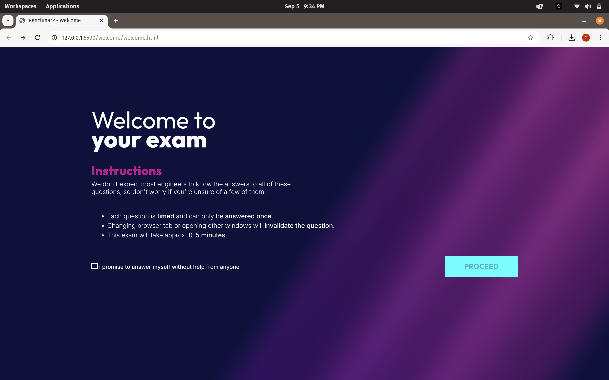
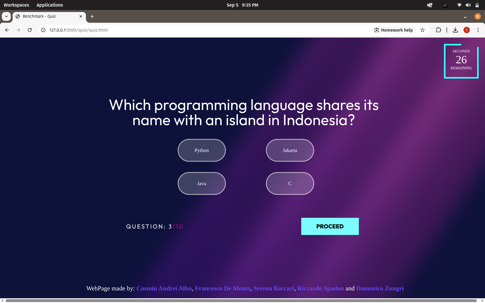

# 📝 Quiz Simulation – Epicode (Modulo 2)

Questo progetto è stato realizzato come **progetto finale del Modulo 2** del corso *Full Stack Developer* presso **Epicode**.  
L’obiettivo era sviluppare una **web app per un Quiz**, utilizzando **HTML, CSS e JavaScript**.

---

## ✨ Funzionalità principali
- **Welcome Page**: schermata introduttiva con regole e istruzioni per l’esame simulato.  
- **Quiz Page**:
  - Timer di **30 secondi per domanda**, con countdown grafico.  
  - Navigazione automatica alla domanda successiva allo scadere del tempo.  
  - Risposte multiple con selezione singola.  
  - Randomizzazione dell’ordine delle domande e delle risposte.  
- **Results Page**:
  - Calcolo punteggio finale e percentuale di risposte corrette/errate.  
  - Messaggio di **superato/non superato** in base al punteggio minimo richiesto (≥ 60%).  
  - Visualizzazione grafica circolare con **conic-gradient**.  
- **Effetti grafici**:
  - Nomi dei contributors colorati casualmente a ogni refresh.  
  - UI moderna e responsive con sfondo in gradienti.

---

## 🛠️ Tecnologie utilizzate
- **HTML5**  
- **CSS3**  
- **JavaScript (ES6)**  

---

## 📂 Struttura del progetto
- `index.html` → entry point principale.  
- `welcome/` → pagina di benvenuto con istruzioni.  
- `quiz/` → logica principale del quiz.  
- `wrongScreen/` → pagina per eventuali errori o deviazioni.  
- `questions/` → dataset delle domande in formato JavaScript.  
- `assets/` → immagini e risorse grafiche.  
- `index.js` → gestione dinamica delle domande, timer, punteggi e risultati.  

---

## 👨‍💻 Contributors
Il progetto è stato sviluppato in collaborazione da **5 studenti Epicode**:  
- **Cosmin Andrei Albu**  
- Francesco De Mento  
- Serena Baccari  
- Riccardo Spadon  
- Domenico Zungri  

---

## 📸 Screenshot

### Welcome Page

### Quiz Page

